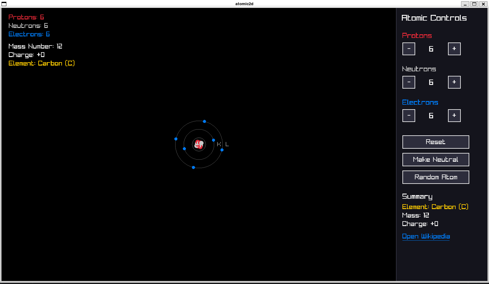
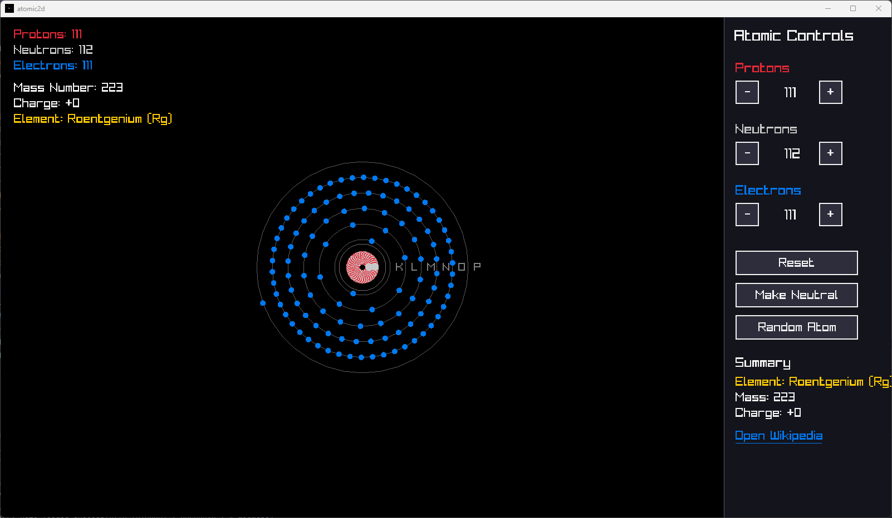

# atomic2d

A small C++ program built with raylib that visualizes atoms using a simplified
Bohr style shell model.

You can adjust the number of protons, neutrons and electrons and see the resulting
atom structure.

Element names are loaded from a text file and a link to element's Wikipedia page can
be opened from the UI.

This project was done in ~4 hours as a small exercise of C++ and Raylib.

## Features

- Bohr style electron shell visualization
- Adjustable protons, neutrons and electrons
- Element lookup from `elements.txt`
- Wikipedia link for the current element
- Simple GUI built directly with Raylib (no Raygui)

## Requirements

- C++17
- CMake

Raylib is downloaded automatically with via CMake.

## Build

```bash
git clone https://github.com/Zank613/atomic2d.git
cd atomic2d

mkdir build
cd build

cmake ..
cmake --build .
```

```bash
./atomic2d
```

## Screenshots




## Note

This is a visual model, not a physically accurate atomic simulation.

Electron shells follow a simplified `2n^2` capacity rule and are meant
only for visualization.